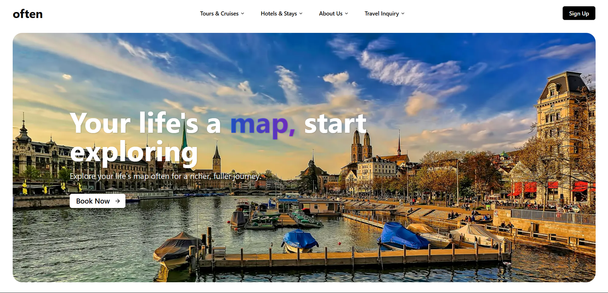

# 🌴 Often Travel - Landing Page

**Often Travel** is a modern, responsive landing page for a travel website. It's designed to showcase travel destinations, highlight features, and attract users to explore or book travel experiences.

Built with **Next.js** and **Tailwind CSS**, this landing page emphasizes performance, mobile-first design, and a clean user interface.

## ✨ Features

- 🏝️ Hero section with stunning visuals
- 📌 Popular destinations section
- 🧭 Key travel services or features
- 📞 Call-to-action (CTA) for bookings or exploration
- 📱 Fully responsive on all devices
- ⚡ Fast load time and smooth animations

## 🚀 Tech Stack

- **Framework:** Next.js
- **Styling:** Tailwind CSS
- **Fonts & Icons:** Google Fonts, Heroicons

## 📸 Preview




## 🛠️ Setup & Run Locally

```bash
# Clone the repo
git clone https://github.com/KoderKalash/often.git

# Go into the project directory
cd often

# Install dependencies
npm install

# Run the development server
npm run dev


